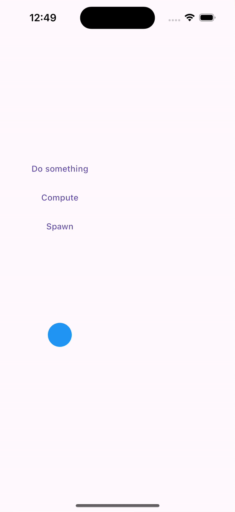
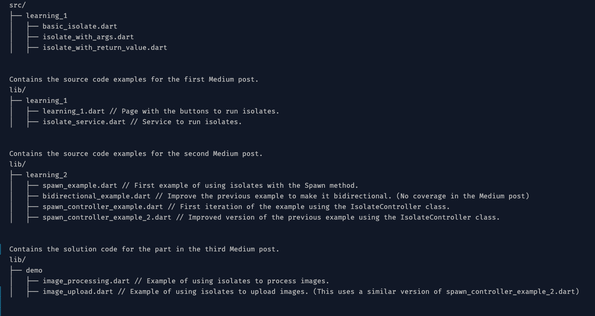
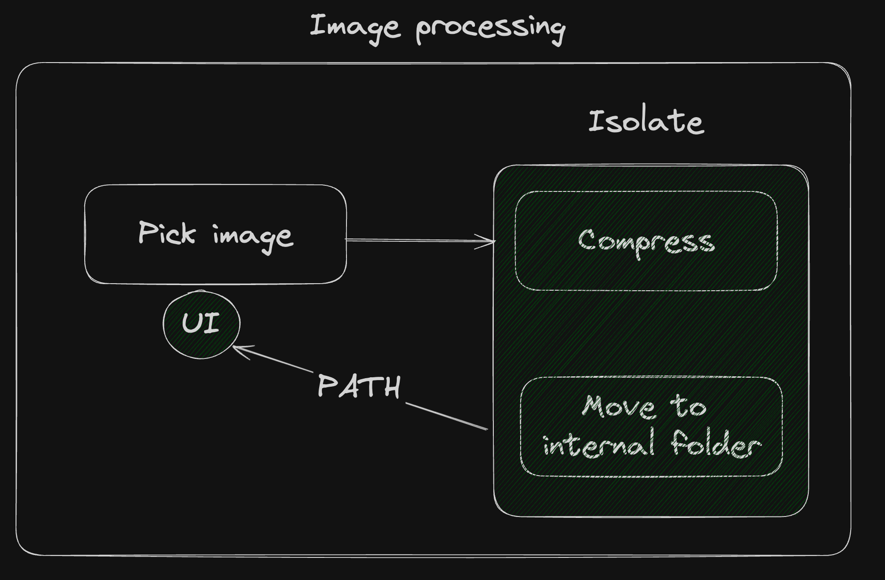
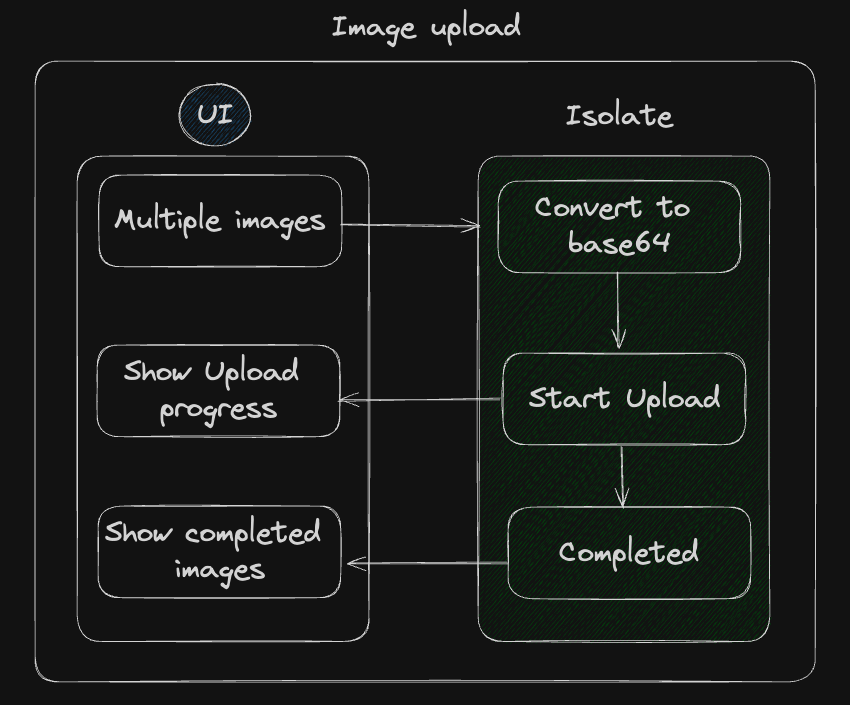

# Decoding Isolates: Basic to Advanced Concepts
Welcome to the Dart Isolates project! In this repository, we explore Dart isolates and their role in concurrent programming. This README provides an overview of the project and its accompanying Medium posts that delve into Dart isolates.

### Project Overview
Dart isolates are a powerful feature for achieving concurrency in Dart applications. They allow you to perform tasks concurrently without blocking the main execution thread. This project aims to provide a comprehensive understanding of Dart isolates, covering fundamental concepts and advanced techniques.

### Medium Posts
We have published three Medium posts as part of this project, offering detailed insights into Dart isolates:

- Part 1 - [Link](https://medium.com/@jamescardona11/decoding-isolates-basic-to-advanced-concepts-part-1-d3289c9f2f16)
- Part 2 - [Link](https://medium.com/@jamescardona11/decoding-isolates-basic-to-advanced-concepts-part2-b94e0b03eff2)
- Part 3 - [Link](https://medium.com/@jamescardona11/decoding-isolates-basic-to-advanced-concepts-part-3-53a766a1f2e6)

### Repository Structure

## Demo problems

### Problem 1
**Image processing**
Create a solution to compress an image; move it to the internal folder of the device and show the compressed image.

### Problem 2
**Upload images to the server.**
Upload the images to the server as a String in Base64; you can pick the images and go to another screen; the upload will be kept in the background and all screens need to listen to the updates.

Happy coding!

